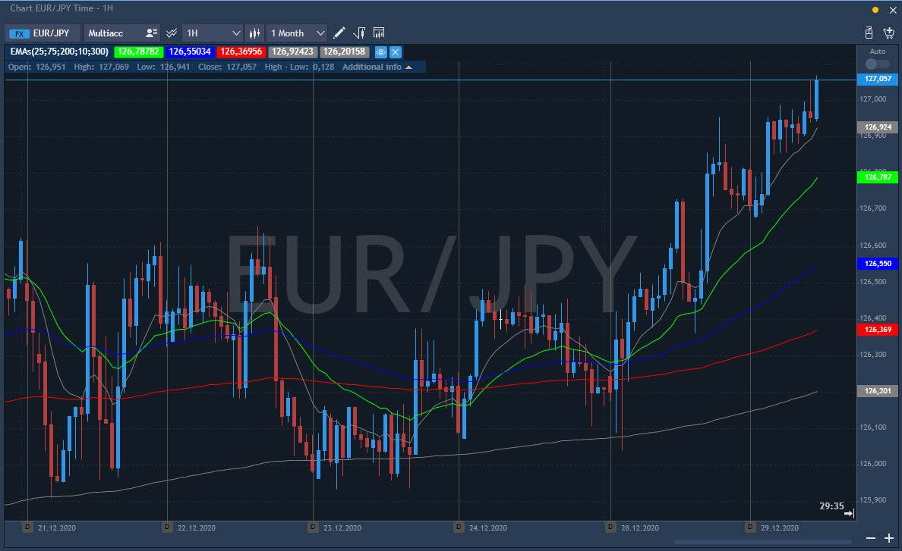

# Multi EMA

The Multi EMA technical indicator is a tool that identifies changing trends, breakouts, and trading opportunities in the price of an asset by combining five Exponential moving averages (EMA) with different time periods as a crossover.

The Exponential moving average is a** **type of moving average that is similar to a simple moving average, except that more weight is given to the latest data. The Exponential moving average is also known as the "Exponentially weighted moving average". 

Moving averages work best in trending markets. A buy signal occurs when the short-term and intermediate-term averages cross from upward above the longer-term average. Conversely, a sell signal is issued when the short-term and intermediate-term averages cross from above to below the longer-term average. The user can utilize the same two Moving average signals, but most market technicians suggest using longer-term averages when trading only two Exponential moving averages in a crossover system.

Another trading approach is to use the current price concept. If the current price is above the Exponential moving averages, you buy. Liquidate this position when the current price crosses below either Moving average. For a short position, sell when the current price is below the Exponential moving average. Liquidate that position when the current price rises above the Exponential Moving Averages.

### Calculation

An exponentially smoothed Moving average is calculated by adding a certain share of the current closing price to the previous moving average value. With exponentially smoothed Moving averages, recent close prices are of more value. P-percent exponential moving average will look like this:

EMA = (CLOSE (i) \* P) + (EMA (i - 1) \* (1 - P))

Where:

CLOSE (i) — current period close price;

EMA (i - 1) — value of the Moving Average of a preceding period;

P — the percentage of using the price value.

### Main parameters

* Period: EMA periods;
* Source price for EMA: Close, Open, High, Low, Median, Typical, and Weighted.

This technical indicator looks as follows on the chart:

