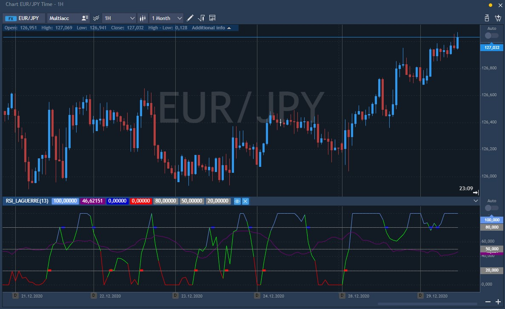

# RSI Laguerre

This technical indicator was created by John F. Ehlers and is a modified version of the Relative Strength Index \(RSI\). For the first time, this indicator was published by John F. Ehlers in Cybernetic Analysis For Stocks And Futures.

As in the case of many other oscillators, the main method of this indicator use is opening of buy orders after the level of indicator crosses above the level of 20 and opening of sell orders after the indicator crosses below the level of 80.

The major parameter of the RSI Laguerre indicator is the alpha factor which equals 1 by default. It is important to note when the value which is less than this level \(for instance, 0.5\) is used, the indicator suggests rather aggressive trading with a big number of trading signals, which negatively influences the outcomes. High values of the indicator’s factor \(more than 85\) are unadvisable as the overvaluation of the parameter may lead to delays in the work of the indicator.

The relevant distinguishing characteristic of the RSI Laguerre technical indicator is the situation when the indicator line takes minimal or maximal value moving strictly in a horizontal way; it means powerful directed movement. Thus, if the indicator equals 1 and moves horizontally, strong trend movement, which is pointed up, prevails on the market. If the indicator equals zero and moves horizontally, then one should open sell deals in the developing downward movement.

The RSI Laguerre indicator plots the weighted RSI indicator value filtered with a Laguerre filter. The sensibility of the Laguerre filter is also self-adjusted with the “fractals energy” in the case of this particular indicator.

### Main parameters

* Alpha factor, 1 by default;
* Source price, available values: Close, Open, High, Low, Typical, Medium, Weighted;
* Fractals energy length, 13 by default.

The indicator itself looks as follows on the chart:

