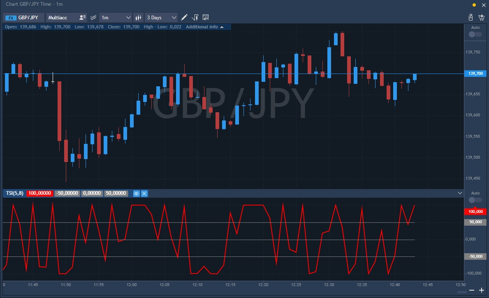

# TSI \(True strength index\)

The True strength index \(TSI\) is a momentum-based indicator, developed by William Blau and introduced in Stocks & Commodities Magazine. The TSI is suitable for intraday time frames as well as long term trading and helps to define the trend, oversold/overbought conditions, centerline crossovers, bullish/bearish divergences, and signal line crossovers.

The True strength index is a version of the Relative strength indicator. It uses a double smoothed EMA of price momentum to diminish constant price changes and pay attention to spot trend shifts with little or zero lag. An increasing True strength value demonstrates increasing momentum in the direction of the price movement.

The indicator is primarily used to identify overbought and oversold conditions in an asset's price, spot divergence, identify trend direction and changes via the centerline, and highlight short-term price momentum with signal line crossovers.

Long Term is the First Period and Short Term is the Second Period used in the double exponential smoothing of momentum.

While the TSI output is bound between +100 and −100, most values fall between +25 and −25. Blau suggests interpreting these values as overbought and oversold levels, respectively, at which point a trader may anticipate a market turn. Trend direction is indicated by the TSI slope; a rising TSI suggests an up-trend in the market, and a falling TSI suggests a down-trend.

### Calculation

The TSI is a "double smoothed" indicator; meaning that a moving average applied to the data \(daily momentum in this case\) is smoothed again by a second moving average. The calculation for TSI uses exponential moving averages. The formula for the TSI is:

Where:

C0 = today's closing price

_m_ = C0 − C1 = momentum \(difference between today's and yesterday's close\)

_EMA \(m, n\)_ = exponential moving average of _m_ over _n_ periods, that is,

### Main parameters

* First R – EMA smoothing period for momentum, default is 5;
* Second S – EMA smoothing period for smoothed momentum, default is 8.

The indicator itself looks as follows on the chart:

