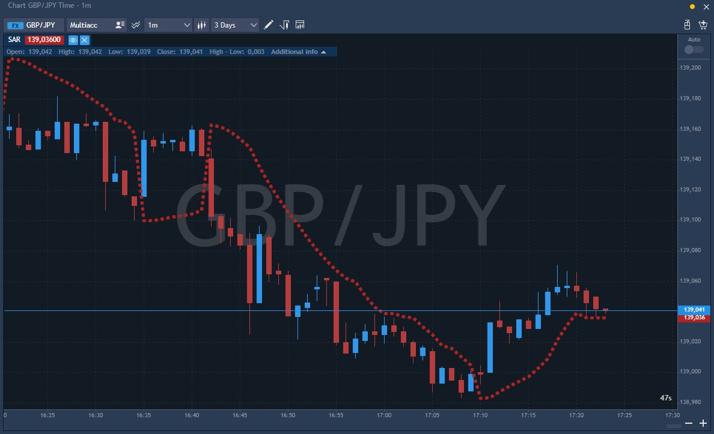

# SAR \(Parabolic time/price system\)

The Parabolic Time/Price system, developed by Welles Wilder, is used to set trailing price stops and is usually referred to as the "SAR" \(stop-and-reversal\). This indicator is explained thoroughly in Wilder's book, New Concepts in Technical Trading Systems. SAR trails price as the trend extends over time. The indicator is below prices when prices are rising and above prices when prices are falling. In this regard, the indicator stops and reverses when the price trend reverses and breaks above or below the indicator. 

**Trading signals:**

Your first step is to confirm that the market is trending:

* Use a trend indicator, or
* Stop trading with the Parabolic SAR if you are whipsawed twice in a row and re-commence after you observe a breakout from the chart pattern.

A trade is signaled when the price bars and stop levels intersect: 

* Go long when price meets the Parabolic SAR stop level, while short;
* Go short when price meets the Parabolic SAR stop level, while long.

### Calculation

Parabolic SAR uses values of the previous period to come up with the new calculation. The calculation also differs regarding whether SAR is rising or falling.

#### Rising Parabolic SAR 

In general, we have three elements – the prior SAR, and two indicator-specific values known as the extreme point \(EP\) and acceleration factor \(AF\).

Prior SAR is simply the SAR value of the previous period.

Extreme point \(EP\) is the highest high of the prevailing uptrend.

Acceleration factor \(AF\), under the indicator’s default settings, starts at .02 and increases by .02 whenever the extreme point \(EP\) makes a new high. Its maximum value is .20 regardless of how many new highs are made by the extreme point.

The acceleration factor value – both the rate at which it can increase and its maximum value – can be adjusted in the settings.

In the SAR calculation formula, the current SAR value is calculated by taking the prior SAR and adding it to the product of the prior acceleration factor and difference between prior extreme point and prior SAR:

Current SAR = Prior SAR + Prior AF \* \(Prior EP – Prior SAR\)

#### Falling Parabolic SAR 

The three elements stay the same – we use prior SAR, extreme point \(EP\), and acceleration factor \(AR\).

They are combined into the SAR formula very similarly, just that instead of adding the second part of the formula, it is subtracted instead.

Current SAR = Prior SAR – Prior AF \* \(Prior EP – Prior SAR\)

### Main parameters

* Step of parabolic SAR system i.e. the acceleration factor, 0.02 by default;
* Maximum step i.e. the extreme point, 0.2 by default.

The indicator itself looks as follows on the chart:

