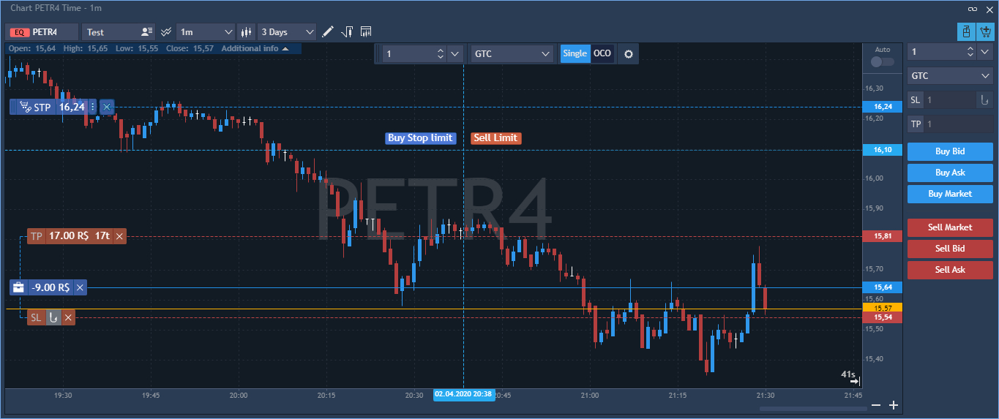

# Visual trading

You can perform trading directly from the chart panel. It is possible to send orders, modify and close/cancel all positions/orders directly from the chart:

### 
**The built-in Order entry panel** 

In order to start visual trading, click the 'Chart trading' button, 
located on the top right corner of the Chart toolbar, and built-in Order entry panel will be opened:


The Order entry panel consists of the following items:

1.      Quantity - the order quantity;

2.      SL - for specifying Stop Loss parameters;

3.      TP - for specifying Take Profit parameters.

Hot buttons for one-click trading are the following:

* Sell Ask – to send a Sell Limit order at the Ask price;
* Sell Bid – to send a Sell Limit order at the Bid price;
* Sell Market – to send a sell market order;
* Buy Market – to send a buy market order;
* Buy Ask – to send a Buy Limit order at the Ask price;
* Buy Bid – to send a Buy Limit order at the Bid price;

### Chart trading

To start chart trading, follow these steps:

1.      Оpen the built-in Order entry panel; Click on the 'Mouse trading' button
to enable the chart trading;

2.      Select type of an order to be placed: single or OCO.

You can enable chart trading by pressing and holding the Ctrl key as well.

If the cursor is higher than the current price, you can send:

* Buy Stop order – by left-click;
* Sell Limit order – by right-click.

If the cursor is lower than a current price, you can send:

* Buy Limit order – left-click of the mouse;
* Sell Stop order – right-click of the mouse.

Orders tooltips are always visible while trading: if order is Buy, then its icon is blue; and if order is Sell, then its icon is red.

To disable the chart trading, click the 'Mouse trading' button again, or just stop holding the Ctrl key.

### Order modifying

To change the order’s price, simply drag and drop the order marker
to the desirable price. To start modifying other parameters, left-click on the order marker. The following buttons will appear:

To cancel order, click thebutton.

Left-clicking the order qty allows to set the required number. Please note that an order can be changed to market by clicking the three-dot button located on the right side of the order widget:

### 
Stop loss and Take profit

If you need to set SL/TP to the order/position, left-click on the order/position marker. After that, SL/TP markers appear. Drag and Drop SL/TP prices to modify them:

